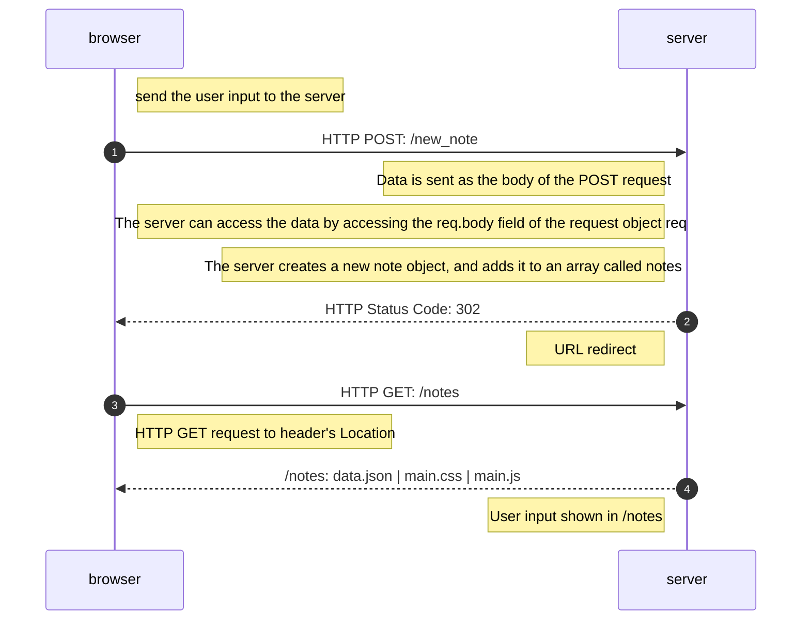

```mermaid
  sequenceDiagram
    autonumber
    participant b as browser
    participant s as server

    Note right of b: send the user input to the server

    b ->> s: HTTP POST: /new_note
    Note left of s: Data is sent as the body of the POST request
    Note left of s: The server can access the data by accessing the req.body field of the request object req
    Note left of s: The server creates a new note object, and adds it to an array called notes
    s -->> b:  HTTP Status Code: 302


    Note left of s: URL redirect

    b ->> s: HTTP GET: /notes
    Note right of b: HTTP GET request to header's Location

    s -->> b: /notes: data.json | main.css | main.js
        Note left of s: User input shown in /notes


```
