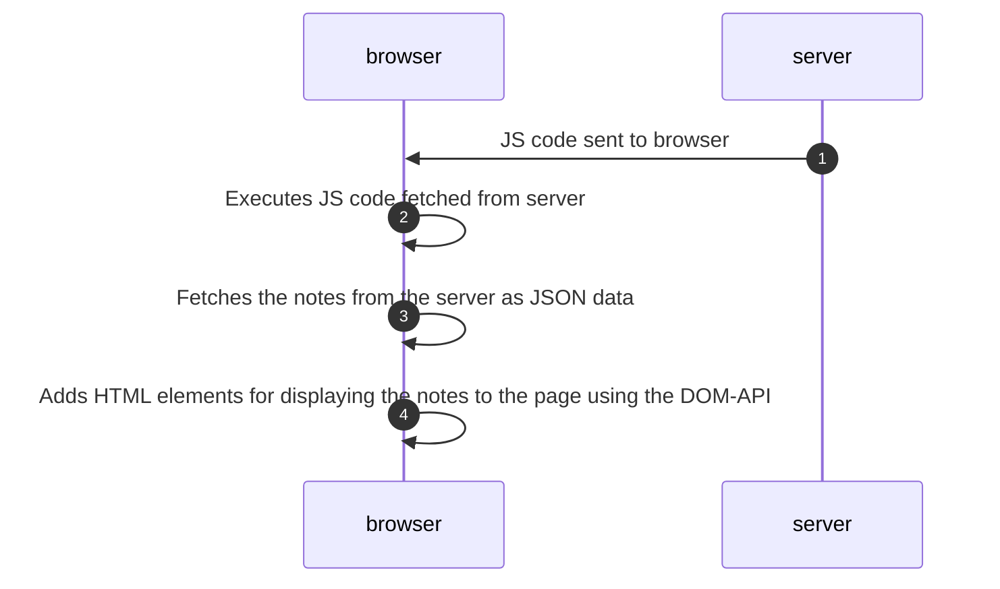

```mermaid
sequenceDiagram
    autonumber
    participant b as browser
    participant s as server

    s ->> b: JS code sent to browser
    b ->> b: Executes JS code fetched from server
    b ->> b: Fetches the notes from the server as JSON data
    b ->> b: Adds HTML elements for displaying the notes to the page using the DOM-API
```
