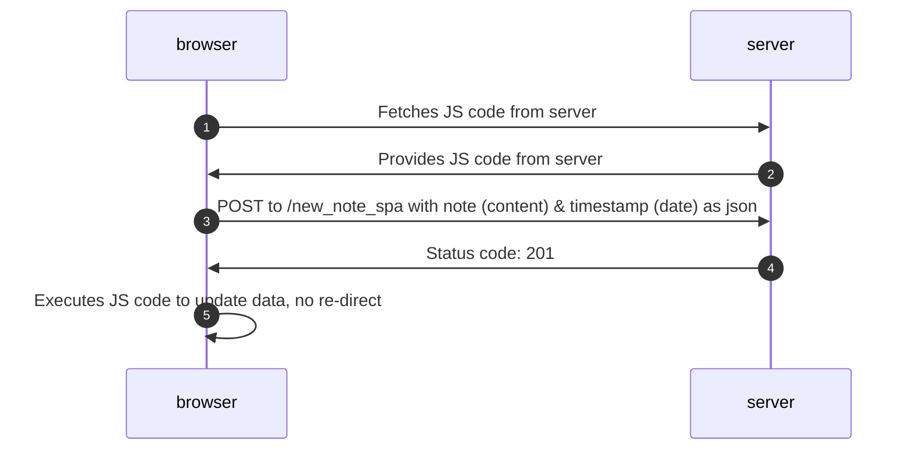

```mermaid
sequenceDiagram
    autonumber
    participant b as browser
    participant s as server

    b ->> s: Fetches JS code from server
    s ->> b: Provides JS code from server
    b ->> s: POST to /new_note_spa with note (content) & timestamp (date) as json
    s ->> b: Status code: 201
    b ->> b: Executes JS code to update data, no re-direct
```
